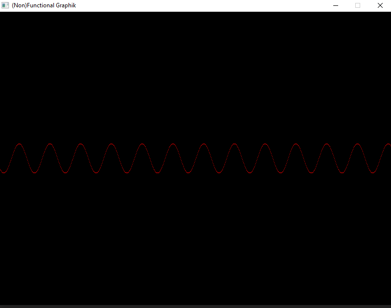
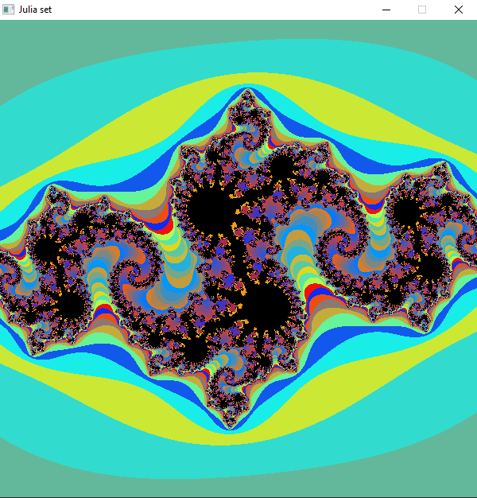

# HaSDL
This is a small and simplistic Haskell binding for the [Simple DirectMedia Layer library(SDL)](https://www.libsdl.org/), 
written in C and Haskell.

## Documentation
For now, there won't be an official documentation. You can use `Hasdl.hs` and `hsbind.c`(the Haskel bindings and C FFI source files respectively)
as reference.

## Examples
Two examples are provided with the project:
- A simplistic remake of the [Graphík Graphical Calculator(GGC)](https://github.com/generot/graphik-compiler-and-utilities).
- An implementation of the Julia set.

Obviously, you can find the compiled binaries of the examples in `bin`, but I would generally 
advise against running binaries you randomly found on the internet 
(*Of course, I know they aren't malicious, I built them after all, but can you really trust me*🤔?).

You'd be much better off if you compile them yourself(for your own sake).

### Examples preview
- GGC, plotting `f(x) = 30 * sin(x)`
  

- The Julia set for `c = −0.8 + 0.156i`
  

## Compilation
To compile HaSDL and the examples, you need:
- [The Glasgow Haskell Compiler(GHC)](https://www.haskell.org/ghc/)
- [The GNU C Compiler(GCC) / MinGW](https://gcc.gnu.org/)
- [make](https://www.gnu.org/software/make/)

The project has been compiled on Windows(evident by the binary extensions and makefile, of course). It should be able to compile on Linux as well, you just need to change the output files' extensions in the makefile. To compile on Windows, you can use Git or the CMD(if you choose the latter, change the calls to `rm` to `del`).